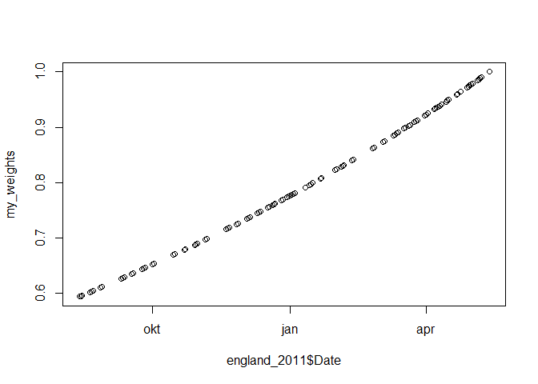

<!-- README.md is generated from README.Rmd. Please edit that file -->

The goalmodel package let you build prediction models for the number of
goals scored in sport games. The models are primarily aimed at modelling
and predicting football (soccer) scores, but could also be applicable
for similar sports, such as hockey and handball.

If you find this package useful, please consider supporting the
development at <https://ko-fi.com/opisthokonta>

[](https://ko-fi.com/opisthokonta)

# Installation

``` r
install.packages("devtools")
devtools::install_github("opisthokonta/goalmodel")
```

# Whats new

### Version 0.6.2 (development version)

-   Can now fit a hurdle model (See A. Owen (2017) The Application of
    Hurdle Models to Accurately Model 0-0 Draws in Predictive Models of
    Football Match Outcomes), but prediction methods are not yet
    implemented.
-   Small bugfixes in the `score_predictions` function.
-   README now has an example of how to use the `score_predictions`
    function.

### Version 0.6

-   New functions predict_btts() and pbtts() for computing
    Both-Teams-To-Score probabilities.
-   New function score_predictions(), for evaluating prediction accuracy
    using Ranked Probability Scores, Brier scores, and Log scores.
-   New function league_table() that computes a league table with points
    and useful summary statistics.

### Version 0.5

-   New function expg_from_ou() - Finds the expected goals from
    over/under probabilities.
-   New function p1x2() - Compute win and draw probabilities from
    expected goals.
-   Bugfix: predict_goals() with return_df=TRUE did not work properly
    when the team arguments were factors.

See NEWS.md for changes for complete version history.

# Overview

The main function in this package is the `goalmodel` function, which is
used to fit a range of different models, including using different
probability distributions and predictors. It also allows for setting
parameters to a fixed value, which can be useful for more advanced
techniques such as two-step estimation.

The following probability distributions are available for fitting with
the `goalmodel` function via the `model` argument:

-   `poisson`, for the independent Poisson model, sometimes also called
    the double Poisson model.

-   `negbin`, for the (independent) negative Binomial model, which
    allows for more variance (overdisperison) than the Poisson model.

-   `cmp`, for the (independent) Conway-Maxwell-Poisson, which allows
    for both underdispersion and overdispersion.

-   `gaussian` for the (independent) bivariate Gaussian (also known as
    the normal distribution) model. This is useful for modelling scores
    that might be decimal numbers.

In addition, the Dixon-Coles model (Dixon and Coles, 1997) is also
available. The model extend the Poisson model so that it modifies the
probabilities for low scores. The Dixon-Coles model can be fitted by
setting the `dc` argument to `TRUE`. Hence, the Dixon-Coles adjustment
can be used not only with Poisson models, but also with the Negative
Binomial and Conway-Maxwell-Poisson models.

With a fitted model, you would want to make predictions. This package
has functions for making different sorts of predictions:

-   `predict_expg`, for predicting expected goals.

-   `predict_goals`, for the scoreline probabilities.

-   `predict_result`, for the final result (home-draw-away or 1x2)
    probabilities.

-   `predict_ou`, for over/under probabilities.

-   `predict_btts`, for both teams to score probabilities.

There are also functions that can be useful for making predictions
without relying on a fitted model, but instead uses expected goals
directly. You can use all of the probability distributions listed above
(except ‘gaussian’) as the underlying model, including the Dixon-Coles
adjustment.

-   `p1x2`

-   `pbtts`

There are a couple of functions for ‘reverse engineering’ results from
other models. These functions relies on the Poisson model.

-   `expg_from_ou` converts over/under probabilities to expected goals.

-   `expg_from_probabilities` converts 1x2 probabilities to expected
    goals.

Misc

-   `weights_dc`, make weights to let results further back in time have
    less influence on the estimates.

-   `score_predictions` computes ‘scoring rules’ to assess the quality
    of predictions.

-   `days_since_last_match` calculates how long it was since the
    previous game for each team.

-   `matches_last_xdays` calculates how many games each team have played
    for a given period in the past.

There are also some functions to work directly with the
Conway-Maxwell-Poisson probability distribution.

-   `dCMP`, `pCMP`, and `qCMP`, are the probability, cumulative and
    quantile functions for the CMP distribution.

-   `eCMP` and `lambdaCMP` converts between expected value and the
    lambda parameter in the CMP distribution.

-   `upsilon.ml` estimates the dispersion parameter (upsilon) from data
    and some given rate (lambda) or mean (mu) parameters.

# The default model

The goalmodel package models the goal scoring intensity so that it is a
function of the two opposing teams attack and defense ratings. Let
λ<sub>1</sub> and λ<sub>2</sub>) be the goal scoring intensities for the
two sides. The default model in the goalmodel package then models these
as

log(λ<sub>1</sub>) = μ + hfa + attack<sub>1</sub> − defense<sub>2</sub>

log(λ<sub>2</sub>) = μ + attack<sub>2</sub> − defense<sub>1</sub>

where μ is the intercept (approximately the average number of goals
scored) and hfa is the home field advantage given to team 1. By default
the number of goals scored, Y<sub>1</sub> and Y<sub>2</sub> are
distributed as

Y<sub>1</sub> ∼ Poisson(λ<sub>1</sub>)

Y<sub>2</sub> ∼ Poisson(λ<sub>2</sub>)

The default model can be modified in numerous ways as detailed in this
vignette.

## Fitting the default model

Models are fitted with the goalmodel function. The minimum required
input are vectors containing the number of goals scored and the names of
the teams. Here I use data from the excellent
[engsoccerdata](https://cran.r-project.org/web/packages/engsoccerdata/)
package.

``` r
library(goalmodel)
library(dplyr) # Useful for data manipulation. 
library(engsoccerdata) # Some data.
library(Rcpp)

# Load data from English Premier League, 2011-12 season.
england %>% 
  filter(Season %in% c(2011),
         tier==c(1)) %>% 
  mutate(Date = as.Date(Date)) -> england_2011


# Fit the default model, with the home team as team1.

gm_res <- goalmodel(goals1 = england_2011$hgoal, goals2 = england_2011$vgoal,
                     team1 = england_2011$home, team2=england_2011$visitor)

# Show the estimated attack and defense ratings and more.
summary(gm_res)
```

    ## Model sucsessfully fitted in 0.03 seconds
    ## 
    ## Number of matches           380 
    ## Number of teams              20 
    ## 
    ## Model                     Poisson 
    ## 
    ## Log Likelihood            -1088.99 
    ## AIC                        2257.98 
    ## R-squared                  0.18 
    ## Parameters (estimated)       40 
    ## Parameters (fixed)            0 
    ## 
    ## Team                      Attack   Defense
    ## Arsenal                    0.36     0.03 
    ## Aston Villa               -0.33    -0.01 
    ## Blackburn Rovers          -0.04    -0.41 
    ## Bolton Wanderers          -0.09    -0.39 
    ## Chelsea                    0.23     0.10 
    ## Everton                   -0.04     0.26 
    ## Fulham                    -0.07     0.02 
    ## Liverpool                 -0.10     0.26 
    ## Manchester City            0.57     0.54 
    ## Manchester United          0.53     0.41 
    ## Newcastle United           0.08     0.01 
    ## Norwich City               0.02    -0.25 
    ## Queens Park Rangers       -0.17    -0.24 
    ## Stoke City                -0.36    -0.01 
    ## Sunderland                -0.14     0.12 
    ## Swansea City              -0.16     0.02 
    ## Tottenham Hotspur          0.24     0.22 
    ## West Bromwich Albion      -0.13     0.00 
    ## Wigan Athletic            -0.19    -0.17 
    ## Wolverhampton Wanderers   -0.22    -0.45 
    ## -------
    ## Intercept                  0.13 
    ## Home field advantage       0.27

# The Dixon-Coles model

In a paper by Dixon and Coles (1997) they introduce a model that extend
the defaul model that modifies the probabilities for low scores, where
each team scores at most 1 goal each. The amount of adjustment is
determined by the parameter ρ (rho), which can be estimated from the
data. The Dixon-Coles model can be fitted by setting the dc argument to
TRUE.

``` r
# Fit the Dixon-Coles model.

gm_res_dc <- goalmodel(goals1 = england_2011$hgoal, goals2 = england_2011$vgoal,
                     team1 = england_2011$home, team2=england_2011$visitor,
                     dc=TRUE)

summary(gm_res_dc)
```

    ## Model sucsessfully fitted in 0.93 seconds
    ## 
    ## Number of matches           380 
    ## Number of teams              20 
    ## 
    ## Model                     Poisson 
    ## 
    ## Log Likelihood            -1087.36 
    ## AIC                        2256.72 
    ## R-squared                  0.18 
    ## Parameters (estimated)       41 
    ## Parameters (fixed)            0 
    ## 
    ## Team                      Attack   Defense
    ## Arsenal                    0.37     0.03 
    ## Aston Villa               -0.31    -0.03 
    ## Blackburn Rovers          -0.06    -0.41 
    ## Bolton Wanderers          -0.08    -0.40 
    ## Chelsea                    0.23     0.09 
    ## Everton                   -0.06     0.27 
    ## Fulham                    -0.07     0.01 
    ## Liverpool                 -0.11     0.25 
    ## Manchester City            0.56     0.55 
    ## Manchester United          0.52     0.43 
    ## Newcastle United           0.10     0.00 
    ## Norwich City               0.02    -0.25 
    ## Queens Park Rangers       -0.18    -0.23 
    ## Stoke City                -0.36    -0.01 
    ## Sunderland                -0.14     0.12 
    ## Swansea City              -0.15     0.01 
    ## Tottenham Hotspur          0.24     0.21 
    ## West Bromwich Albion      -0.14     0.00 
    ## Wigan Athletic            -0.19    -0.17 
    ## Wolverhampton Wanderers   -0.21    -0.46 
    ## -------
    ## Intercept                  0.12 
    ## Home field advantage       0.27 
    ## Dixon-Coles adj. (rho)    -0.13

Notice how the estimated ρ parameter is listed together with the other
parameters.

# The Rue-Salvesen adjustment

In a paper by Rue and Salvesen (2001) they introduce an adjustment to
the goals scoring intesities λ<sub>1</sub> and λ<sub>2</sub>:

log(λ<sub>1</sub><sup>adj</sup>) = log(λ<sub>1</sub>) − γΔ<sub>1,2</sub>

log(λ<sub>2</sub><sup>adj</sup>) = log(λ<sub>2</sub>) + γΔ<sub>1,2</sub>

where

Δ<sub>1,2</sub> =
(attack<sub>1</sub>+defense<sub>1</sub>−attack<sub>2</sub>−defense<sub>2</sub>)/2

and γ is a parameter that modifies the amount of adjustment. This model
can be fitted by setting the rs argument to TRUE.

``` r
# Fit the model with the Rue-Salvesen adjustment.

gm_res_rs <- goalmodel(goals1 = england_2011$hgoal, goals2 = england_2011$vgoal,
                     team1 = england_2011$home, team2=england_2011$visitor,
                     rs=TRUE)

summary(gm_res_rs)
```

    ## Model sucsessfully fitted in 0.56 seconds
    ## 
    ## Number of matches           380 
    ## Number of teams              20 
    ## 
    ## Model                     Poisson 
    ## 
    ## Log Likelihood            -1088.99 
    ## AIC                        2259.98 
    ## R-squared                  0.18 
    ## Parameters (estimated)       41 
    ## Parameters (fixed)            0 
    ## 
    ## Team                      Attack   Defense
    ## Arsenal                    0.36     0.03 
    ## Aston Villa               -0.33    -0.02 
    ## Blackburn Rovers          -0.05    -0.42 
    ## Bolton Wanderers          -0.09    -0.40 
    ## Chelsea                    0.23     0.10 
    ## Everton                   -0.04     0.26 
    ## Fulham                    -0.07     0.01 
    ## Liverpool                 -0.10     0.26 
    ## Manchester City            0.58     0.54 
    ## Manchester United          0.54     0.42 
    ## Newcastle United           0.09     0.01 
    ## Norwich City               0.02    -0.25 
    ## Queens Park Rangers       -0.17    -0.24 
    ## Stoke City                -0.36    -0.02 
    ## Sunderland                -0.14     0.12 
    ## Swansea City              -0.16     0.02 
    ## Tottenham Hotspur          0.24     0.22 
    ## West Bromwich Albion      -0.13    -0.00 
    ## Wigan Athletic            -0.20    -0.18 
    ## Wolverhampton Wanderers   -0.23    -0.46 
    ## -------
    ## Intercept                  0.13 
    ## Home field advantage       0.27 
    ## Rue-Salvesen adj. (gamma)  0.02

# Making predictions

There is little use in fitting the model without making predictions.
Several functions are provided that make different types of predictions.

We can get the expected goals with the predict_expg function. Here the
return_df is set to TRUE, which returns a convenient data.frame.

``` r
to_predict1 <- c('Arsenal', 'Manchester United', 'Bolton Wanderers')
to_predict2 <- c('Fulham', 'Chelsea', 'Liverpool')

predict_expg(gm_res_dc, team1=to_predict1, team2=to_predict2, return_df = TRUE)
```

    ##               team1     team2    expg1     expg2
    ## 1           Arsenal    Fulham 2.119358 1.0243004
    ## 2 Manchester United   Chelsea 2.291612 0.9288743
    ## 3  Bolton Wanderers Liverpool 1.069974 1.5090408

We can also get the probabilities of the final outcome (team1 win, draw,
team2 win) with the predict_result function.

``` r
predict_result(gm_res_dc, team1=to_predict1, team2=to_predict2, return_df = TRUE)
```

    ##               team1     team2        p1        pd        p2
    ## 1           Arsenal    Fulham 0.6121100 0.2266543 0.1612357
    ## 2 Manchester United   Chelsea 0.6685366 0.2051625 0.1263009
    ## 3  Bolton Wanderers Liverpool 0.2524546 0.2903231 0.4572222

Other functions are predict_goals which return matrices of the
probabilities of each scoreline, and predict_ou for getting the
probabilities for over/under total scores.

# Weights

For predicton purposes it is a good idea to weight the influence of each
match on the estimates so that matches far back in time have less
influence than the more recent ones. The Dixon-Coles paper describe a
function that can help set the weights. This function is implemented in
the weights_dc function. The degree more recent matches are weighted
relative to earlier ones are determined by the parameter xi. Good values
of xi is usually somewhere between 0.001 and 0.003

Here we calculate the weights, plot them, and fit the default model with
the weights.

``` r
my_weights <- weights_dc(england_2011$Date, xi=0.0019)

length(my_weights)
```

    ## [1] 380

``` r
plot(england_2011$Date, my_weights)
```



``` r
gm_res_w <- goalmodel(goals1 = england_2011$hgoal, goals2 = england_2011$vgoal, 
                     team1 = england_2011$home, team2=england_2011$visitor,
                     weights = my_weights)
```

# Additional covariates

It is possible to use additional variables to predict the outcome. One
particular useful thing this can be used for is to have greater control
of the home field advantage. For example if you use data from several
leagues you might want to have a separate home field advantage for each
league, or be able to turn of the advantage for games played on neutral
ground.

Here is how to specify the default model with the home field advantage
specified as an additional covariate. Notice how the hfa argument is set
to FALSE, so that the default home field advantage factor is droped.
Also notice that only covariates for the first team is given, implicitly
setting all values of this covariate to 0 for team2.

``` r
# Create a n-by-1 matrix, containing only 1's, to indicate that all 
# games have a home team.
xx1_hfa <- matrix(1, nrow=nrow(england_2011), ncol=1)
colnames(xx1_hfa) <- 'hfa' # must be named.

# Fit the default model, with the home team as team1.
gm_res_hfa <- goalmodel(goals1 = england_2011$hgoal, goals2 = england_2011$vgoal,
                     team1 = england_2011$home, team2=england_2011$visitor,
                    hfa = FALSE, # Turn of the built-in Home Field Advantage
                    x1 = xx1_hfa) # Provide the covariate matrix.

# the coefficients for the additional covariates are found in the 'beta' element in 
# the parameter list. They will also show up in the summary.
gm_res_hfa$parameters$beta
```

    ##       hfa 
    ## 0.2680093

# Alternatives to the Poisson model

By the default the Poisson distribution is used to model the goals. The
Poisson distribution has a lot of nice properties, but also some
limitations. For instance there is only one parameter that describes
both the expected value (the average) and the variance. It is also
limited to integer number of goals.

## The Negative Binomial model

The Negative Binomial (NB) model is a more flexible model that allows
higher variance than the Poisson model. The NB model introduces another
parameter called the “dispersion” parameter. This parameter has to be
positive, and the greater the value of this parameter, the more variance
there is relative to the Poisson model with the same *λ*. When the
variance is greater than the expectation, it is referred to as
overdispersion. When the parameter is close to zero, it the result is
approximately the Poisson. The NB model can be fitted by setting the
“model” argument to ‘negbin’. In this example the dispersion parameter
is close to zero.

``` r
# Fit the model with overdispersion.

gm_res_nb <- goalmodel(goals1 = england_2011$hgoal, goals2 = england_2011$vgoal,
                     team1 = england_2011$home, team2=england_2011$visitor,
                     model='negbin')


gm_res_nb$parameters$dispersion
```

    ## [1] 4.517136e-05

## The Conway-Maxwell-Poisson model

While the Negative Binomial model is more flexible than the Poisson
model in that it can model excess variance, the Conway-Maxwell-Poisson
(CMP) model is even more flexible. The CMP can be both over-dispersed
and under-dispersed. The dispersion parameter controlling the amount of
dispersion is called *υ* (upsilon), and behaves a bit different than the
dispersion parameter in the Negative Binomial. When *υ* = 1 the model
becomes the Poisson model. If *υ* is greater than 1 the variance is less
than the expectation, and we have under-dispersion. If *υ* is between 0
and 1, there is over-dipsersion.

Unfortunately, the CMP distribution is a bit difficult to work with for
several reasons. It is not built-in in R, so I have implemented some of
the relevant distribution functions (called dCMP and pCMP). It also has
a normalizing constant that is a bit difficult to compute, and must be
approximated. The distribution functions have an argument called ‘error’
that determines the amount of approximation, and has a default that is
precise enough for our needs.

The perhaps most confusing thing with the CMP model is that it has a
parameter called *λ*, and this parameter does NOT behave like the *λ* in
the Poisson or NB models. In those models the lambda is the same as the
expectation, but this is not the case for the CMP. To make matters
worse, there is no simple forumla for finding the expectation for a
given set of values of *λ* and *υ*, although an approximate formula
exists. Therefore I have included two functions to compute the
expectation (eCMP) and another to find the *λ* for a given set of values
for the expectation and dispersion (lambdaCMP).

To fit and use a model with the CMP distribution is easy, you can just
set model == ‘cmp’ in the goalmodel function. However, because of all
the complications with this model, estimating the parameters can be
really slow. Under the hood, I have tried to speed things up by using
approximations where I could, but it is still slow. I therefore recomend
using two-step estimation to fit this model. If you fit this model, and
see that there is overdispersion (dispersion \< 1), it can be a good
idea to use the NB model instead.

``` r
# Fit the CMP model, with the attack and defence parameters fixed to the values in the default model.
gm_res_cmp_2s <- goalmodel(goals1 = england_2011$hgoal, goals2 = england_2011$vgoal,
                     team1 = england_2011$home, team2=england_2011$visitor, 
                     model='cmp', fixed_params = gm_res$parameters)

# Take a look at the dispersion. It indicates under-dispersion.
gm_res_cmp_2s$parameters$dispersion
```

    ## [1] 1.122462

## The Gaussian model

It is also possible to use model = ‘gaussian’ to fit models using the
Gaussian (or normal) distribution. This option is intended to be used
when the scores are decimal numbers. This could be useful if instead of
actual goals scored, you wanted to fit a model to expected goals. You
can’t combine this with the Dixon-Coles adjustment, except perhaps using
a two step procedure. If you use a Gaussian model to make predictions,
the Poisson distribution will be used, and a warning will be given.

# Fixed parameters - Two step estimation.

If you want to, you can set some of the parameters to a fixed value that
is kept constant during model fitting. In other words, you don’t
estimate the fixed parameters from the data, but set them manually
beforehand and all other parameters are estimated with this in mind.

This feature can be useful for doing two-step estimation. Sometimes the
model fitting can be unstable, especially when the model is complicated.
It can then be a good idea to first fit a simpler model, like the
default model, and then with the parameters from the simpler model kept
constant, estimate the rest of the parameters in a second step.

Here is an example of two-step fitting of the Dixon-Coles model.

``` r
# Fit the Dixon-Coles model, with most of the parameters fixed to the values in the default model.
gm_res_dc_2s <- goalmodel(goals1 = england_2011$hgoal, goals2 = england_2011$vgoal,
                     team1 = england_2011$home, team2=england_2011$visitor, 
                     dc=TRUE, fixed_params = gm_res$parameters)

# Compare the two estimates of rho. They are pretty similar. 
gm_res_dc_2s$parameters$rho
```

    ## [1] -0.1261445

``` r
gm_res_dc$parameters$rho
```

    ## [1] -0.1336961

# Offset - Varying playing time

Sometimes the playing time can be extended to extra time. In football
this usually happens when there is a draw in a knock-out tournament,
where an additional 30 minutes is added. To handle this, we must add
what is called an offset to the model. You can read more about the
details on
[wikipedia](https://en.wikipedia.org/wiki/Poisson_regression#%22Exposure%22_and_offset).

There is no offset option in the goalmodel package, but we can add it as
an extra covariate, and fix the parameter for that covariate to be 1. In
the example below we add a game from the 2011-12 FA Cup to the data set
which was extended to extra time. Then we create the offset variable and
fit the model with the fixed parameter. Note that the offset variable
must be log-transformed. In this example, the extra game that is added
is the only game in the data set where Middlesbrough is playing, so the
estimates will be a bit unstable. Also note that the number of minutes
played is divided by 90, the ordinary playing time, otherwise the model
fitting tend to get unstable.

``` r
# Get matches from the FA cup that was extended to extra time.
facup %>% 
  filter(Season == 2011,
         round >= 4, 
         aet == 'yes') %>% 
  select(Date, home, visitor, hgoal, vgoal, aet) %>% 
  mutate(Date = as.Date(Date)) -> facup_2011

facup_2011
```

    ##             Date          home    visitor hgoal vgoal aet
    ## 16005 2012-02-08 Middlesbrough Sunderland     1     2 yes

``` r
# Merge the additional game with the origianl data frame.
england_2011 %>% 
  bind_rows(facup_2011) %>% 
  mutate(aet = replace(aet, is.na(aet), 'no')) -> england_2011_2

# Create empty matrix for additional covariates
xx_offset <- matrix(nrow=nrow(england_2011_2))
colnames(xx_offset) <- 'Offset'

# Add data
xx_offset[,'Offset'] <- 90/90 # Per 90 minutes

# Extra time is 30 minutes added.
xx_offset[england_2011_2$aet == 'yes','Offset'] <- (90+30)/90

# Offset must be log-transformed.
xx_offset <- log(xx_offset)

# Take a look.
tail(xx_offset)
```

    ##           Offset
    ## [376,] 0.0000000
    ## [377,] 0.0000000
    ## [378,] 0.0000000
    ## [379,] 0.0000000
    ## [380,] 0.0000000
    ## [381,] 0.2876821

``` r
# fit the model
gm_res_offset <- goalmodel(goals1 = england_2011_2$hgoal, goals2 = england_2011_2$vgoal, 
                           team1 = england_2011_2$home, team2=england_2011_2$visitor,
                          # The offset must be added to both x1 and x2.
                          x1 = xx_offset, x2 = xx_offset,
                          # The offset parameter must be fixed to 1.
                          fixed_params = list(beta = c('Offset' = 1)))

summary(gm_res_offset)
```

    ## Model sucsessfully fitted in 0.96 seconds
    ## 
    ## Number of matches           381 
    ## Number of teams              21 
    ## 
    ## Model                     Poisson 
    ## 
    ## Log Likelihood            -1091.30 
    ## AIC                        2266.60 
    ## R-squared                  0.18 
    ## Parameters (estimated)       42 
    ## Parameters (fixed)            1 
    ## 
    ## Team                      Attack   Defense
    ## Arsenal                    0.39     0.05 
    ## Aston Villa               -0.30     0.01 
    ## Blackburn Rovers          -0.02    -0.39 
    ## Bolton Wanderers          -0.06    -0.38 
    ## Chelsea                    0.26     0.12 
    ## Everton                   -0.01     0.28 
    ## Fulham                    -0.04     0.03 
    ## Liverpool                 -0.08     0.28 
    ## Manchester City            0.60     0.55 
    ## Manchester United          0.56     0.43 
    ## Middlesbrough             -0.53    -0.40 
    ## Newcastle United           0.11     0.03 
    ## Norwich City               0.05    -0.23 
    ## Queens Park Rangers       -0.14    -0.22 
    ## Stoke City                -0.33     0.01 
    ## Sunderland                -0.11     0.14 
    ## Swansea City              -0.13     0.04 
    ## Tottenham Hotspur          0.27     0.23 
    ## West Bromwich Albion      -0.11     0.02 
    ## Wigan Athletic            -0.17    -0.16 
    ## Wolverhampton Wanderers   -0.20    -0.43 
    ## -------
    ## Intercept                  0.12 
    ## Home field advantage       0.27 
    ## Offset                     1.00

# Modifying parameters

In addition to fixing parameters before the model is fit, you can also
manually set the parameters after the model is fitted. This can be
useful if you believe the attack or defence parameters given by the
model is inacurate because you have some additional information that is
not captured in the data.

Modifying the parameters can also be useful for the same reasons as you
might want to fit the model in two (or more) steps. For intance, if you
look at the log-likelihood of the default model, and the model with the
Rue-Salvesen adjustment, you will notice that they are almost identical.
This is probably due to the model being nearly unidentifiable. That does
not neccecarily mean that the Rue-Salvesen adjustment does not improve
prediction, it might mean that it is hard to estimate the amount of
adjustment based on the available data. In the paper by Rue & Salvesen
they find that setting γ to 0.1 is a good choice. Here is how this can
be done:

``` r
# Copy the default model.
gm_res_rs2 <- gm_res

# set the gamma parameter to 0.1
gm_res_rs2$parameters$gamma <- 0.1

# Make a few predictions to compare.
predict_result(gm_res, team1=to_predict1, team2=to_predict2, return_df = TRUE)
```

    ##               team1     team2        p1        pd        p2
    ## 1           Arsenal    Fulham 0.6197118 0.2035688 0.1767195
    ## 2 Manchester United   Chelsea 0.6736194 0.1843756 0.1420050
    ## 3  Bolton Wanderers Liverpool 0.2612112 0.2567706 0.4820183

``` r
predict_result(gm_res_rs2, team1=to_predict1, team2=to_predict2, return_df = TRUE)
```

    ##               team1     team2        p1        pd        p2
    ## 1           Arsenal    Fulham 0.6047391 0.2083325 0.1869284
    ## 2 Manchester United   Chelsea 0.6539250 0.1917532 0.1543218
    ## 3  Bolton Wanderers Liverpool 0.2780789 0.2603511 0.4615700

# Evaluating predictions

To evaluate and compare the quality of predictions between different
models, you need a measure of how well the predictions match the
observed outcomes. The `score_predictions` function can help with this,
and implements three different scoring rules. Here is an example of how
it works. The example is done in-sample, but a proper evaluation should
compute scores out-of-sample.

``` r
my_predictions_default <- predict_result(gm_res, team1 = to_predict1, team2 = to_predict2, return_df = TRUE)
my_predictions_dc <- predict_result(gm_res_dc, team1 = to_predict1, team2 = to_predict2, return_df = TRUE)


england_2011 %>% 
  # Select the games to evaluate
  mutate(teams_string = paste(home, '-', visitor)) %>% 
  filter(teams_string %in% paste(to_predict1, '-', to_predict2)) %>% 
  # Transform the result column (H, D, A) to reflect the column names of the prediction matrix.
  mutate(result2 = c('H' = 'p1', 'D'='pd', 'A' = 'p2')[result]) %>% 
  select(home, visitor, result2) -> england_2011_to_score


predictions_scores_default <- score_predictions(predictions = my_predictions_default[,c('p1','pd','p2')], 
                                        observed = england_2011_to_score$result2, 
                                        score = c('log', 'brier', 'rps'))


predictions_scores_dc <- score_predictions(predictions = my_predictions_dc[,c('p1','pd','p2')], 
                                        observed = england_2011_to_score$result2, 
                                        score = c('log', 'brier', 'rps'))

# Total log score for default model, 4.27
sum(predictions_scores_default$log)
```

    ## [1] 4.273418

``` r
# Total log score for Dixon-Coles model, 4.33, which is better than for default.
sum(predictions_scores_dc$log)
```

    ## [1] 4.336003

# Miscalaneous

## Reverse engineering expected goals

The function predict_result that’s demonstrated above uses the
underlying statistical model and the expected goals from fitted
goalmodel to compute the probabilities for win-draw-lose. The function
expg_from_probabilities can be used to reverse this procedure, going
from probabilities to the underlying expected goals.

This can be used to reverse-engineer predictions from other models or
even bookmaker odds. The expected goals extracted from this method can
for example be used as input to the goalmodel to get attack and defense
ratings, and to make new predictions.

Here is some code demonstrating that it can recover the expected goals
which are made from a fitted goalmodel with the Poisson distribution.

``` r
# Win-Draw-Lose probabilities.
wdl_probs <- predict_result(gm_res, team1=to_predict1, team2=to_predict2, 
                            return_df = TRUE)

wdl_probs
```

    ##               team1     team2        p1        pd        p2
    ## 1           Arsenal    Fulham 0.6197118 0.2035688 0.1767195
    ## 2 Manchester United   Chelsea 0.6736194 0.1843756 0.1420050
    ## 3  Bolton Wanderers Liverpool 0.2612112 0.2567706 0.4820183

``` r
expg_reveng <- expg_from_probabilities(wdl_probs[,c('p1', 'pd', 'p2')])

expg_reveng$expg
```

    ##          [,1]      [,2]
    ## [1,] 2.098592 1.0272203
    ## [2,] 2.278604 0.9458234
    ## [3,] 1.049001 1.5224753

``` r
# Compare with expected goals predictions from above.
predict_expg(gm_res_dc, team1=to_predict1, team2=to_predict2, return_df = TRUE)
```

    ##               team1     team2    expg1     expg2
    ## 1           Arsenal    Fulham 2.119358 1.0243004
    ## 2 Manchester United   Chelsea 2.291612 0.9288743
    ## 3  Bolton Wanderers Liverpool 1.069974 1.5090408

You can also specify the Dixon-Coles parameter ρ (rho). Unfortunately it
is not possible to extract both the two expected goals and rho, since
there will typically be a large number of combinations of the three
parameters that yield the same probabilities. With rho given as a
constant it is however possible to extract the expected goals. Here is
how you can recover the expg from the DC model fitted above, using rho =
-0.13.

``` r
# Win-Draw-Lose probabilities from DC model
wdl_probs_dc <- predict_result(gm_res_dc, team1=to_predict1, team2=to_predict2, 
                            return_df = TRUE)

wdl_probs_dc
```

    ##               team1     team2        p1        pd        p2
    ## 1           Arsenal    Fulham 0.6121100 0.2266543 0.1612357
    ## 2 Manchester United   Chelsea 0.6685366 0.2051625 0.1263009
    ## 3  Bolton Wanderers Liverpool 0.2524546 0.2903231 0.4572222

``` r
# Use the rho argument to specify rho.
expg_reveng_dc <- expg_from_probabilities(wdl_probs_dc[,c('p1', 'pd', 'p2')],
                                      rho = -0.13)

expg_reveng_dc$expg
```

    ##          [,1]      [,2]
    ## [1,] 2.110870 1.0181919
    ## [2,] 2.283149 0.9231111
    ## [3,] 1.063635 1.5016544

``` r
# Compare with expected goals predictions from above.
predict_expg(gm_res_dc, team1=to_predict1, team2=to_predict2, return_df = TRUE)
```

    ##               team1     team2    expg1     expg2
    ## 1           Arsenal    Fulham 2.119358 1.0243004
    ## 2 Manchester United   Chelsea 2.291612 0.9288743
    ## 3  Bolton Wanderers Liverpool 1.069974 1.5090408

# Other packages

There are some other packages out there that have similar functionality
as this package. The [regista](https://github.com/Torvaney/regista)
package implements a more general interface to fit the Dixon-Coles
model. The
[fbRanks](https://cran.r-project.org/web/packages/fbRanks/index.html)
package implements only the Dixon-Coles time weighting functionality,
but has a lot of other features. In
[footBayes](https://cran.r-project.org/package=footBayes) you can fit
models with Bayesian procedures. The package includes several models,
including bivariate Poisson models and models with time-varying attack
and defense parameters.

# References

-   Mark J. Dixon and Stuart G. Coles (1997) Modelling Association
    Football Scores and Inefficiencies in the Football Betting Market.
-   Håvard Rue and Øyvind Salvesen (2001) Prediction and Retrospective
    Analysis of Soccer Matches in a League.
